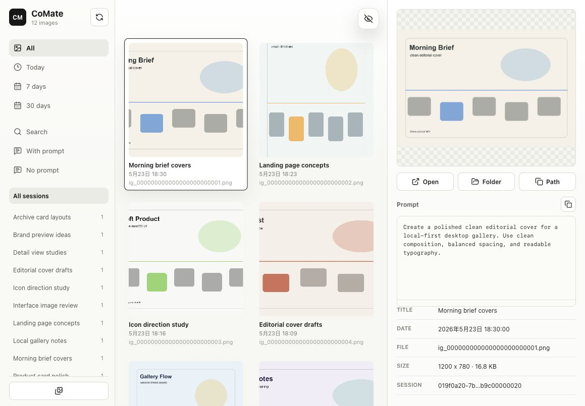

# CoMate

[English](./README.md)

<p align="center">
  
</p>

CoMate 是一个给 Codex Desktop 使用的本地 companion app。它会索引 Codex 在你电脑上生成的图片，把图片和本地 session 元数据、prompt 关联起来，并提供一个干净、私密的图片浏览界面和 Codex 能力图谱。



## 功能亮点

- 用本地图库浏览 Codex Desktop 生成的图片。
- 支持搜索、按时间筛选、按 prompt 状态筛选，并可在生成 session 之间切换。
- 查看 prompt、图片元数据、文件路径和所在目录。
- 支持把选中图片直接复制到 macOS 剪贴板。
- 查看本机 Codex 的 Skills、Plugins、MCP、Commands、Automations 和 Issues。
- 完全本地运行，不需要登录，没有统计分析、遥测或云同步。

## 为什么做它

Codex Desktop 会在不同会话里生成很多有用的图片。CoMate 的目标是让这些本地图片更容易浏览、搜索、回看 prompt 和打开文件，同时不上传任何数据，也不依赖云服务。

## 隐私边界

- 完全本地运行。
- 不需要登录、API key、统计分析或遥测。
- 图库不需要网络连接。
- 只读取你电脑上的 Codex Desktop 本地数据。
- 默认把自己的 SQLite 索引放在 `~/.comate`。

## Codex Desktop 数据目录

CoMate 是给 Codex 桌面应用做的 companion app，不是 Codex CLI 工具。默认读取：

```text
~/.codex/generated_images
~/.codex/session_index.jsonl
~/.codex/sessions
```

可以用环境变量覆盖路径：

```bash
CODEX_HOME=/path/to/codex-data
COMATE_HOME=/path/to/comate-data
COMATE_DB=/path/to/comate.sqlite
```

## 安装

```bash
npm install
```

## 不安装桌面 App，直接本地启动

也可以不使用 Electron 桌面版，直接从源码启动本地 Web 服务：

```bash
npm run start:local
```

然后打开：

```text
http://127.0.0.1:4388
```

`4388` 是默认本地 Web 端口。如果这个端口已经被占用，可以换一个端口：

```bash
COMATE_WEB_PORT=4392 npm run start:local
```

## 开发模式

启动 Web UI 和 API：

```bash
npm run dev
```

默认开发地址：

- Web UI: `http://127.0.0.1:4388`
- API: `http://127.0.0.1:4389`

开发模式会用 Vite 启动 Web UI，并单独启动 API 进程。如果 Web 端口被占用，Vite 可能会打印一个临时顺延端口；上面的生产本地启动命令会使用单一的 `COMATE_WEB_PORT`。

## 桌面应用

启动 Electron 桌面版：

```bash
npm run desktop
```

构建未签名的 macOS 安装包：

```bash
npm run package:mac
```

构建产物会输出到 `release/`。

GitHub Actions 里的 **Package macOS App** workflow 也可以构建未签名的 macOS 产物。推送到 `main` 会自动运行 CI，推送 `v*` tag 时可以发布 release artifacts。

## Web 生产模式

```bash
npm run start:local
```

## 测试

```bash
npm test
npm run build
```

## GitHub Actions

仓库已经配置：

- `CI`：push 和 pull request 时自动运行测试和生产构建。
- `Package macOS App`：手动触发时构建未签名的 macOS `.dmg` / `.zip`，推送 `v*` tag 时会发布 GitHub Release。

## macOS Gatekeeper

当前公开构建是未签名版本。如果 macOS 阻止启动，可以右键 app 选择 **打开**，或者在 **系统设置 > 隐私与安全性** 中允许打开。

正式的签名和公证版本需要 Apple Developer 凭据，默认没有配置。

## License

MIT
